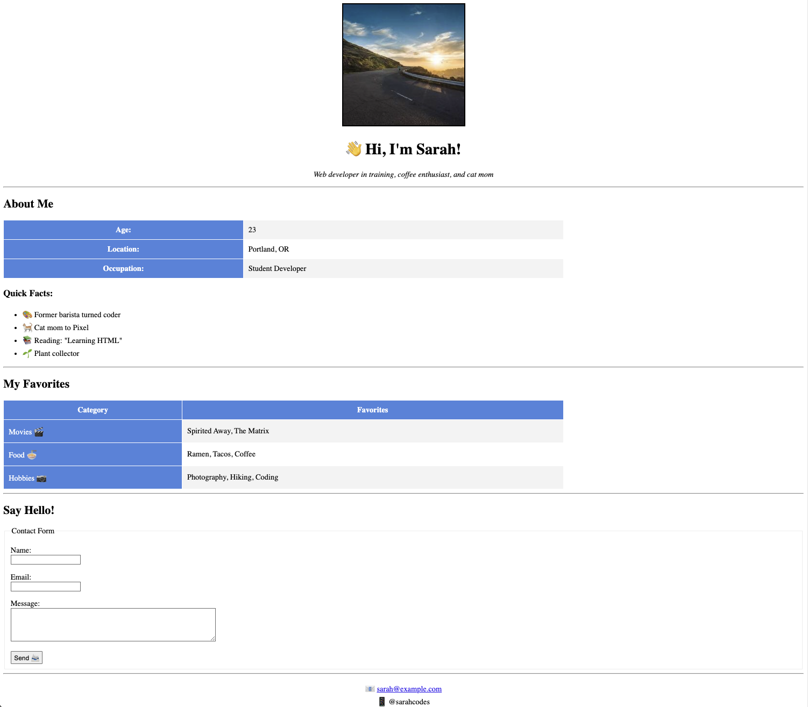

# Personal Profile Page
Creating a personal profile page is an essential skill for web developers. It's often the first project in any developer's portfolio and serves as a digital introduction to who you are. In this project, you'll create a simple yet effective personal profile page using HTML fundamentals! 🎉

This hands-on project is designed to help you practice core HTML concepts while building something personal and meaningful.

🗒️ **How to Start This Project?**
---
1. **Ensure You Have a GitHub Account**
   If you don't have one, sign up at [https://github.com](https://github.com/).
2. Navigate to the project template
   - Create a repository from the template to your account
   - Open the project with a new codespace
   - Once you did it once you can open the codespace that was previously created.
---
## **📝 Requirements:**
- Create the HTML needed to build your personal profile page.
 

---
#### **Required Sections:**
- **Header Section**
  - Profile Image
  - Name
  - Brief Introduction
- **About Me Section**
  - Personal Information Table
  - Quick Facts List
- **Favorites Section**
  - Structured Table with Categories
- **Contact Form**
  - Input Fields
  - Submit Button
---
#### **HTML Elements to Use:**
- **Basic Structure**
  - Document Type Declaration
  - Head and Body Sections
  - Proper Meta Tags
- **Text Elements**
  - Headings (h1, h2, h3)
  - Paragraphs
  - Emphasis (em)
- **Tables**
  - Basic Table Structure
  - Table Headers
  - Colored Backgrounds
  - Cell Padding
- **Lists**
  - Unordered Lists
  - List Items
- **Forms**
  - Input Fields
  - Text Areas
  - Buttons
  - Fieldset and Legend
- **Other Elements**
  - Images with Borders
  - Horizontal Rules
  - Center Tag
  - HTML Entities for Emojis

---
#### **Basic Styling:**
- Use basic HTML attributes for styling:
  - `border`
  - `width`
  - `cellpadding`
  - `bgcolor`
- Use `center` tag for alignment

---
### **🤔 What to Do If You Are Stuck?**
#### **Review Fundamentals:**
- Review HTML basic elements and attributes
- Check HTML table documentation
- Look up form element examples
#### **Ask for Help:**
- Reach out to your instructor or peers for assistance

---
### **📚 Fundamentals Covered**
#### This exercise covers the following fundamentals:
1. **HTML Document Structure**
2. **Semantic HTML Elements**
3. **HTML Tables and Their Attributes**
4. **Form Elements and Structure**
5. **Lists (Ordered and Unordered)**
6. **Image Elements and Attributes**
7. **HTML Entities**
8. **Basic HTML Styling Attributes**
9. **Text Formatting**
10. **HTML Forms and Input Types**

---
## **✅ Submission Checklist**
- [ ] All required sections are present
- [ ] Profile image is properly displayed with border
- [ ] Tables are properly structured with colors
- [ ] Forms include all required fields
- [ ] HTML entities (emojis) are correctly displayed
- [ ] All headings are properly centered
- [ ] Tables have correct width and padding
- [ ] Lists are properly formatted
- [ ] Code is clean and well-indented
- [ ] Code includes helpful comments
- [ ] All links (email, social) are functional

### **🌟 Bonus Challenges**
1. Add more HTML entities for decoration
2. Create additional tables with different color schemes
3. Add more form input types
4. Include a detailed hobby section
5. Add a favorite quotes section
---

Remember: Keep it simple and focus on clean, well-structured HTML. This project is about mastering HTML fundamentals before moving on to CSS!
